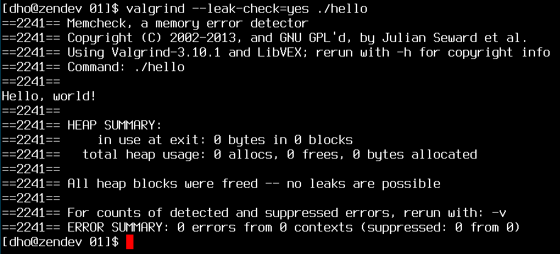

# Introduction to C

---

# What is C

 * Dennis Ritchie - AT&T Bell Labs - 1972
 * Targeted 16-bit DEC PDP-11
 * Still widely used today
 * Applies to wide range of computer architectures
 * Used where efficiency / performance is critical
 * Provides low-level access

---

# Features of C

 * Small: few keywords
 * Has compound data types (structures, unions)
 * Pointers (managing memory, array access)
 * Comprehensive standard library
 * Compiles to native machine code
 * Has a macro preprocessor

---

# Versions of C

Evolved over the years:

 * 1972 - Invented
 * 1978 - "The C Programming Language" published, first language specification
 * 1989 - C89 standard (also known as ANSI C)
 * 1990 - ANSI C adopted by ISO, known as C90
 * 1999 - C99 standard
 * 2011 - C11 (formerly C1x), ratified December 8, 2011
 * C11 still gaining support by major compilers

We will use C99 in this course.

---

# What is C used for?

Systems programming!

 * Operating systems (Linux, BSDs, Plan 9, etc.)
 * Microcontrollers (automobile ECUs, airplanes, etc.)
 * Embedded processors (phones, portable electronics, etc.)
 * DSPs (set-top boxes, digital audio and TV systems, etc.)
 * High performance / low latency software

---

# C vs. Related Languages

 * Many derivatives adding new features (C++, Objective C, C#)
 * Influenced Java, Perl, VCL
 * Fewer features than many of these languages
 * No exceptions
 * No range checking
 * No garbage collection
 * No "true" object oriented programming
 * No implicit polymorphism

---

# Warning: Low-level Language

C is inherently "unsafe":

 * No range checking
 * Limited type safety at compile-time
 * No runtime type checking

Handle with care:

 * Develop inside a debugger (gdb, lldb)
 * Never run your code as `root`
 * Never test code on production machines

---

# Writing C Programs

---

# Editing C Code

 * Source code is just a text file
 * Has `.c` extension
 * Can use a regular text editor

---

# Compiling a Program

 * We will be using gcc
 * Other compilers exist (clang, `6c`)
 * Included in most Linux distributions
 * `$ gcc input.c -o output`
 * Preprocess -> compile -> link

---

# Compiler Options

 * Options change the behavior of the compiler
 * Warnings for common pitfalls
 * Multiple source files
 * Auxiliary directories for libraries and headers
 * Optimization and linking

`$ gcc -g -O0 -Wall input.c -o output`

 * Enable debugging symbols
 * Disable optimization
 * Enable warnings for most common errors

---

# Debugging

---

# Using GDB

 * `break [location]` - break at `line`, `file.c:line`, `symbol` or `0xaddress`
 * `run` - execute the target binary
 * `continue` - continue execution after breakpoint
 * `next` - execute next line
 * `step` - execute next line or step into function
 * `quit` - exit GDB session
 * `print [expression]` - print value of specified expression
 * `help [command]` - in-line help

---

# Valgrind

 * Memory errors are common in C
 * Valgrind helps detect many of these
 * Useful tool for later lectures

---

# IDEs - The All-In-One "Solution"

 * Provide editor / compiler / debugger integration
 * Useful for learning
 * Popular IDEs include Eclipse (CDT), KDevelop, Xcode, etc.
 * Use what you're comfortable with
 * Get CDT at http://www.eclipse.org/cdt/
 * Information on using it at http://www.eclipse.org/cdt/doc/overview/

---

# Our First C Program

---

# Hello, world!

 * Traditional "learn to code" program
 * Syntax: how to specify a C program
 * Top-down structure: undeclared data is unknown
 * Comments, macros, basic declarations
 * The `main` function, and function structure
 * Expressions, order-of-operations (remember PEMDAS?)
 * Basic console I/O

---

# Structure of a C file

    !c
    /* Begin with comments about file contents, license, etc. */

    #include <necessary.h>

    void function_prototype(void);
    int global_var;

    int
    main(void)
    {
        // Function body
    }

    void
    function_prototype(void)
    {
        // Function body
    }

---

# Comments

 * C99 supports single line comments with `//`
 * Multi-line comments are created in `/* */` blocks
 * Multi-line comments cannot be nested
 * Contents are completely ignored by compiler and preprocessor
 * Can appear almost anywhere
 * SWEng note: commenting is an art

&nbsp;

    !c
    /*
     * hello.c: our first C program
     * Created by dho, 16 Mar 2015
     */

---

# The `#include` Macro

 * Usually used for header files
 * Headers contain declarations for constants, functions, and variables
 * Replaces the `#include` line with contents of specified file
 * Pop quiz: why are header files usually included at the top?

&nbsp;

    !c
    #include <stdio.h> // C standard library I/O functions

---

# Header Files

 * `stdio.h` is part of the "standard library"
 * Many other common headers: `string.h`, `stdlib.h`, `time.h`, ad nauseum
 * You don't need to learn these by heart (but you will)
 * Compiler resolves them by looking in an "include path"
 * Include path can be changed in gcc with an option `-I`*directory*
 * `#include <header.h>` and `#include "header.h"` have different behavior

---

# Variables

 * Variables are arbitrarily named representations for a value
 * They don't have to vary (but usually do)
 * Variables must be declared before use (forward declaration)
 * Variable declaration follows pattern `Type VarName`
 * `int`, `double`, and `char`: data types
 * Many other types exist (more covered next lecture)
 * Examples:

&nbsp;

    !c
    int                i;
    double        d;
    char        c;

---

# Initializing Variables

 * Called "definition"
 * Uninitialized variables assume a default value (usually undefined)
 * Variables are initialized with assignment operator `=`
 * Looks like mathematical equality, isn't
 * Variables may be initialized when declared or later
 * Can declare and initialize multiple variables at once

&nbsp;

    !c
    float pi, e = 2.71828182846;
    int n = 42;

    pi = 3.14159265359;

---

# Arithmetic Expressions

Suppose `x` and `y` are defined variables:

 * Arithmetic operators like `+`, `-`, `*`, and `/` work as expected
 * `x + y`, `x - y`, `x * y`, `x / y`
 * Statements: `y = x + 3 * x / (y - 4);`
 * Numeric literals like `42` or `3.14` are valid in expressions
 * Statements in C terminate with a semicolon
 * Shorthand arithmetic and assignment operators exist:
   `x += y`, `x -= y`, `x *= y`, `x /= y`

---

# Order of Operations

 * Mostly algebraic (remember PEMDAS?)
 * `+` and `-` as a sign: right to left
 * `*`, `/`, `%`: left to right
 * `+`, `-`: left to right
 * `=`, `+=`, `-=`, `*=`, `/=`, `%=`: right to left

---

# Function Prototypes

 * Must be declared before use
 * Declaration is a *function prototype*.
 * Commonly used functions declared in header files for the standard library
 
&nbsp;

    !c
    int factorial(int n);

---

# Function Prototypes

 * General form: `return_value_type function_name(argtype1 arg1, argtype2 arg2, ...);`
 * Arguments: data provided to function by caller
 * *Everything in C is passed by value*
 * `void` signifies no return value or no arguments.

 &nbsp;

    !c
    void endless_function(int foo);
    int selfstanding_function(void);
    void sometimes_useful(void);

---

# The `main` Function

 * Defined as the entry point for C programs
 * Simplest version: no inputs or outputs, returns 0 on success
 * Two-argument form allows receiving arguments from command line
 * We'll cover the second form in a later lecture

&nbsp;

    !c
    int main(void);
    int main(int argc, char **argv);

---

# Function Definitions

     return_value_type
     function_name(argtype arg1)
     {
         variable declarations;

         program statements;
     }

---

# Function Definitions

 * Must match prototype (if one exists)
 * Curly braces define a *block*.
 * Variables declared in a block are scoped within that block
 * C99 permits variable declarations anywhere within a block

---

# Our `main` Function

    !c
    int
    main(void)
    {
        printf("Hello, world!\n");
        return 0;
    }

 * `printf` outputs text to "standard output"
 * String literal in double quotes
 * return the value `0` to the caller to indicate success

---

# Alternative Method

    !c
    int
    main(void)
    {
        const char hello[] = "Hello, world!\n";

        printf(hello);
        return 0;
    }

 * `const`: keyword means value is constant
 * `char`: single character data type
 * `const char hello[]`: a constant array of characters

---

# Strings in C

 * Strings are arrays of characters
 * Terminated by a `NUL` byte (`\0`)
 * String literals *implicitly contain NUL-byte*
 * Special / non-printable characters are "escaped" with a backslash (`\`)
 * `\\`: backslash, `\"`: double quote, `\r`: carriage return, `\n`: newline, `\t`: tab
 * Character literals `\oNN` or `\xNN` to specify in octal or hex

---

# Console I/O

 * `stdin`, `stdout`, `stderr`: standard streams for input and output
 * `printf` writes strings to standard output (more on `printf` later)
 * Other interfaces exist, but we will cover those later

---

# Preprocessor Macros

 * Macros begin with a hash (`#`) at the start of a line
 * We've observed include files, numerous other macros exist
 * Most common: `#define X Y` replaces any occurence of the literal pattern X with the literal pattern Y
 * Useful for specifying constants

&nbsp;

    !c
    #define HELLO "Hello, world!\n"

---

# Macros as Functions

 * Defined macros can take arguments
 * Macros are replaced in-place and single-pass
 * Can't do recursion with macros

&nbsp;

    !c
    #define MUL(a, b) ((a) * (b))
    MUL(2 * 3 - 1, 4);
    /* (2 * 3 - 1) * 4 = 20 */

    #define MUL(a, b) a * b
    MUL(2 * 3 - 1, 4);
    /* 2 * 3 - 1 * 4 = 2 */

---

# Conditional Preprocessor Macros

 * `#if`, `#ifdef`, `#ifndef`, `#else`, `#elif`, `#endif`
 * Conditional macros, usually used to conditionally compile code
 * `gcc -DNAME=val` causes definition of values usable by these macros

&nbsp;

    !c
    #ifndef BEANHEAD
    # define HELLO "Hello, world!\n"
    #else
    # define HELLO "Hello, beanhead!\n"
    #endif

    #ifndef _HEADER_FILE_
    #define _HEADER_FILE_
    /* declarations */
    #endif

---

# Other Macros

 * Can do you own research, but uncommonly used and we won't use them
 * `#pragma`: for utilizing compiler-specific behaviors
 * `#error`: cause the compiler to error
 * `#warning`: cause the compiler to generate a warning
 * `#undef`: undefine a previously defined macro

---

# Circling Back: Our Code

    !c
    /*
     * hello.c: say hello!
     */

    #include <stdio.h>

    int
    main(void)
    {
        printf("Hello, world!\n");
        return 0;
    }

---

# Compiling

`$ gcc -g -O0 -Wall hello.c -o hello`

---

# Running

    $ ./hello
    Hello, world!
    $

---

# Running in GDB

    $ gdb ./hello
    GNU gdb (GDB) 7.9
    Copyright (C) 2015 Free Software Foundation, Inc.
    License GPLv3+: GNU GPL version 3 or later <http://gnu.org/licenses/gpl.html>
    This is free software: you are free to change and redistribute it.
    There is NO WARRANTY, to the extent permitted by law.  Type "show copying"
    and "show warranty" for details.
    This GDB was configured as "x86_64-unknown-linux-gnu".
    Type "show configuration" for configuration details.
    For bug reporting instructions, please see:
    <http://www.gnu.org/software/gdb/bugs/>.
    Find the GDB manual and other documentation resources online at:
    <http://www.gnu.org/software/gdb/documentation/>.
    For help, type "help".
    Type "apropos word" to search for commands related to "word"...
    Reading symbols from ./hello...done.
    (gdb) r
    Starting program: /home/dho/projects/cs6087/lectures/01/hello 
    Hello, world!
    [Inferior 1 (process 30292) exited normally]
    (gdb) q
    $ 

---

# Overview of Topics

 * History of C
 * How to edit, compile, and run C programs
 * Order of operations
 * Comments
 * String literals
 * Macros

